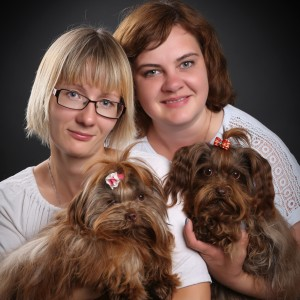

<!-- Анонс -->

   
Ожидаем рождение помета Русской Цветной Болонки в конце <i>сентября 2020</i>

   Планируются вязки:
   <ul>
      <li>Восточноевропейская овчарка 2020г</li>
      <li>Русская цветная болонка 2020г</li>
      <li>Якутская Лайка 2021г</li>
      <li>Австралийский хиллер 2021г</li>
      <li>Сенбернар 2021г</li>
      <li>Среднеазиатская овчарка 2021г</li>
   </ul>
   <!-- 
   28.07.2019 Рожден помет русской цветной болонки: две суки палевого окраса. 
   06.08.2019 Рожден помет русской цветной болонки: два кобеля и две суки коричневого окраса.   
   <a href="2019/04/19/prodaetsa.html">Продаётся сука русской цветной болонки, рожденная</a> 19.04.2019 -->

<table class="head-table">
    <tr>
        <td>
            
<b>Содружество питомников собак</b>

            <h2 class="pitomnik-title">Невская Лига Грейт Гардарика</h2>

            

            
VK: 
                <a href="vk.com/pitomniksobak" target="_blank">https://vk.com/pitomniksobak</a>
            

                Facebook: 

            <ul>
                <li><a href="https://m.facebook.com/victoria.gorlova.9" target="_blank">Виктория Горлова</a></li>
                <li><a href="https://m.facebook.com/profile.php?id=100011614756006" target="_blank">Мария Гришина</a></li>
            </ul>

            

                Руководители: <b>Гришина М.И.</b>, <b>Горлова В.М.</b>
            

        </td>
        <td>
            
        </td>
    </tr>
</table>

_Невская Лига_ и _Грейт Гардарика_ сотрудничают с 2016 года
и ориентированы на разведение отечественных пород собак:

- восточно-европейская овчарка;
- русская цветная болонка;
- среднеазиатская овчарка;
- якутская лайка.

Руководители питомников имеют профессиональное кинологическое образование, позволяющее заниматься
разведением, дрессировкой, содержанием собак.

Мы обеспечиваем консультативную пожизненную помощь, отслеживаем их судьбу и стараемся участвовать в жизни 
наших выпускников.

## Новости

<ul>
   <li>Рожден помет среднеазиатской овчарки 8 щенков <small>05.12.2019</small></li>
   <li>Рожден помет Русской Цветной Болонки 3 щенка (г. Новоуральск) <small>22.12.2019</small></li>
   <li>Рожден помет Русской Цветной Болонки 4 щенка <small>28.02.2020</small></li>
   <li>Рожден помет Русской Цветной Болонки 2 щенка <small>18.03.2020</small></li>
   <li>Рожден помет восточноевропейской овчарки 10 щенков <small>17.05.2020</small></li>
  
    <li>
      <a href="{{ post.url | relative_url }}">{{ post.title }}</a> <small>{{post.date | date: '%d.%m.%Y' }}</small>
    </li>
  
</ul>

## Контакты

    

        +7 911 244 97 59 &mdash; Мария Ильинична Гришина 
        +7 921 633 22 21 &mdash; Виктория Михайловна Горлова
    

Питомник находится в городе Санкт-Петербург, Красное Село.

## Достижения

    

        
    

    

        
    

    

        
    

    

        
    

    

         
    

    

        
    

    

         
    

<h2>Образование</h2>

   

   Благодарность от школы дрессировки АККОРД, 2019:
   
   

   

   Сертификат участника конференции по зоопсихологии, 2016:
   
   

   

   Свидетельство Виктории Горловой о присвоении квалификации, профессия инструктор по племенной работе и дрессировке, судья по породам собак, судья по рабочим качествам и спорту (организация ДОСААФ) 2016:
   
   

   

   Свидетельства о присвоении званий кинолога-дрессировщика, 2012:
   
   

